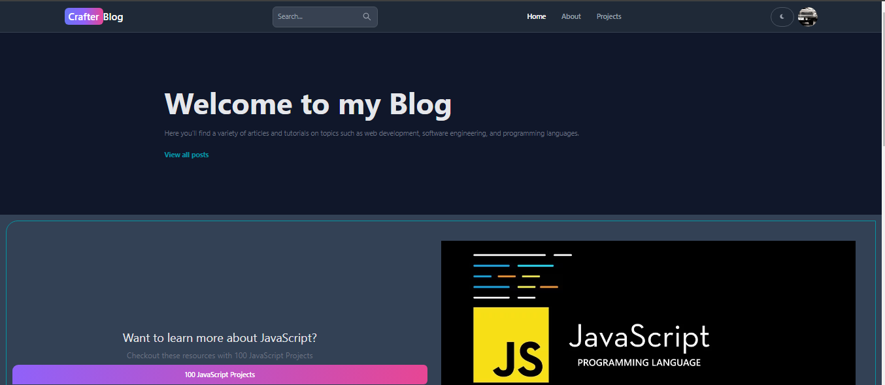
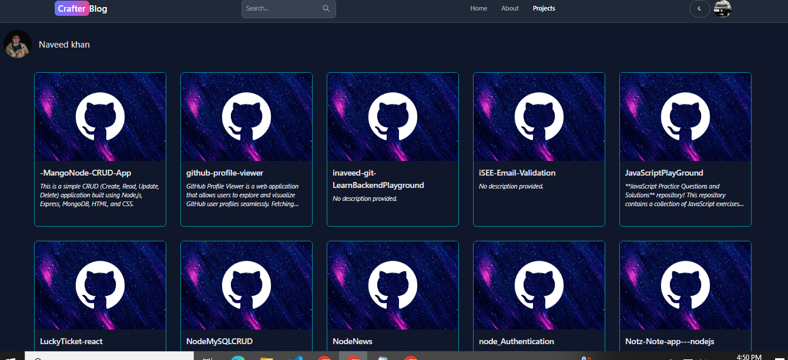
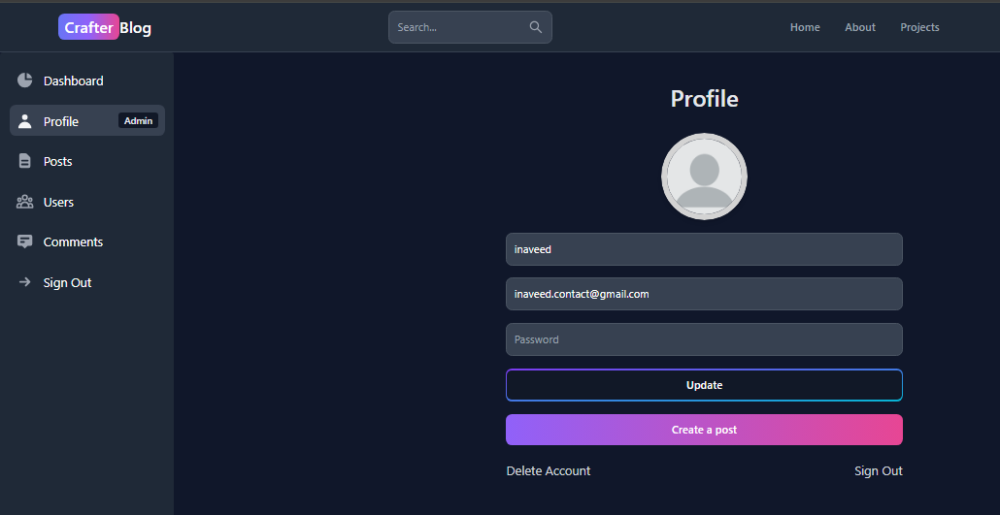
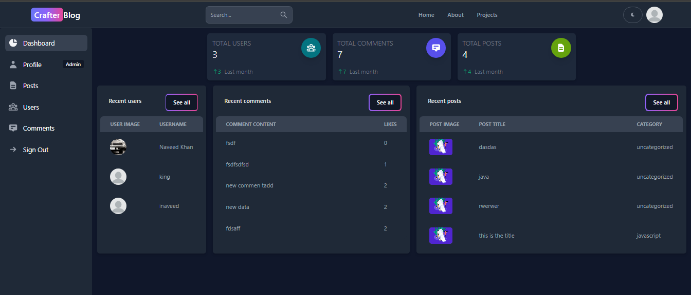

# CrafterBlog

CrafterBlog is a web application that allows users to create, manage, and interact with blog posts and comments. It features user authentication via Firebase, providing a secure and efficient way to handle user accounts. For writing content, we utilize Quill.js, a powerful rich text editor. The application also supports both dark and light modes, enhanced UI with Tailwind CSS and Flowbite, and uses Redux Toolkit for state management.

## Features

- User authentication (signup, signin, Google login) using Firebase
- Create, edit, and delete posts
- Comment on posts
- Like comments
- Get comments associated with a post
- User management (view, update, and delete users)
- Rich text editing with Quill.js
- Dark and light mode support
- Responsive UI with Tailwind CSS and Flowbite components
- State management with Redux Toolkit

## ScreenShot







## Getting Started

### Prerequisites

Make sure you have the following installed on your machine:

- [Node.js](https://nodejs.org/) (version 14 or later)
- [npm](https://www.npmjs.com/get-npm) (comes with Node.js)
- A MongoDB instance running locally or remotely
- A Firebase project for authentication

### Installation

1. **Clone the repository:**

   ```bash
   git clone https://github.com/inaveed-git/CrafterBlog.git
   cd CrafterBlog
   ```

2. **Install dependencies for the backend:**

   From the root of the project, run:

   ```bash
   npm install
   ```

3. **Set up environment variables:**

   Create a `.env` file in the root of the project and add your backend and frontend configuration:

   **Backend Configuration:**

   ```plaintext
   MONGO_URL=mongodb://127.0.0.1:27017/mernBlog
   PORT=8080
   JWT_SECRET=codewithsecret
   ```

   **Frontend Configuration:**
   Add your Firebase configuration and API key in a `.env` file in the `client` directory:

   ```plaintext
   VITE_FIREBASE_API_KEY="Add your firebase key "
   ```

   To get your Firebase API key:

   1. Go to the [Firebase Console](https://console.firebase.google.com/).
   2. Select your project.
   3. Navigate to Project Settings > General.
   4. Copy your API key from there.

4. **Install dependencies for the frontend:**

   Navigate to the `client` directory:

   ```bash
   cd client
   npm install
   ```

### Firebase Security Rules

For Firestore and Storage, make sure to add the following rules in your Firebase project:

```plaintext
// Craft rules based on data in your Firestore database
// allow write: if firestore.get(
//    /databases/(default)/documents/users/$(request.auth.uid)).data.isAdmin;

service firebase.storage {
  match /b/{bucket}/o {
    match /{allPaths=**} {
      allow read;
      allow write: if
        request.resource.size < 2 * 1024 * 1024 &&
        request.resource.contentType.matches('image/.*');
    }
  }
}
```

These rules ensure that:

- Only users with an admin role can write to specific parts of Firestore.
- Storage allows writing only if the file size is less than 2MB and the content type matches images.

### Adding Admin Users

To add an admin user, you need to edit the user directly in the database. The user schema is defined as follows:

```javascript
import mongoose from "mongoose";

const userSchema = new mongoose.Schema(
  {
    username: {
      type: String,
      required: true,
      unique: true,
    },
    email: {
      type: String,
      required: true,
      unique: true,
    },
    password: {
      type: String,
      required: true,
    },
    profilePicture: {
      type: String,
      default:
        "https://cdn.pixabay.com/photo/2015/10/05/22/37/blank-profile-picture-973460_960_720.png",
    },
    isAdmin: {
      type: Boolean,
      default: false, // Change this to true in the database directly
    },
  },
  { timestamps: true }
);

const User = mongoose.model("User", userSchema);

export default User;
```

To make a user an admin, set the `isAdmin` field to `true` in your MongoDB database.

### Running the Application

1. **Start the backend server:**

   From the root of the project, run:

   ```bash
   npm run dev
   ```

2. **Start the frontend development server:**

   Open a new terminal window, navigate to the `client` directory, and run:

   ```bash
   npm run dev
   ```

### API Endpoints

The backend exposes the following API endpoints:

- **Auth**

  - `POST /signup`: Register a new user
  - `POST /signin`: Sign in a user
  - `POST /google`: Sign in using Google

- **Posts**

  - `POST /create`: Create a new post (protected)
  - `GET /getposts`: Retrieve all posts
  - `DELETE /deletepost/:postId/:userId`: Delete a post (protected)
  - `PUT /updatepost/:postId/:userId`: Update a post (protected)

- **Comments**

  - `POST /create`: Create a new comment (protected)
  - `GET /getPostComments/:postId`: Get comments for a specific post
  - `PUT /likeComment/:commentId`: Like a comment (protected)
  - `PUT /editComment/:commentId`: Edit a comment (protected)
  - `DELETE /deleteComment/:commentId`: Delete a comment (protected)
  - `GET /getcomments`: Get all comments (protected)

- **Users**
  - `GET /test`: Test endpoint
  - `PUT /update/:userId`: Update user information (protected)
  - `DELETE /delete/:userId`: Delete a user (protected)
  - `POST /signout`: Sign out a user
  - `GET /getusers`: Get all users (protected)
  - `GET /:userId`: Get a specific user

## License

This project is licensed under the MIT License - see the [LICENSE](LICENSE) file for details.

## Acknowledgments

- [Firebase](https://firebase.google.com/) for authentication
- [Express](https://expressjs.com/) for the backend framework
- [Quill.js](https://quilljs.com/) for rich text editing
- [MongoDB](https://www.mongodb.com/) for the database
- [React](https://reactjs.org/) for the frontend framework
- [Tailwind CSS](https://tailwindcss.com/) for styling
- [Flowbite](https://flowbite.com/) for prebuilt UI components
- [Redux Toolkit](https://redux-toolkit.js.org/) for state management

## Contact

For inquiries, please reach out to: [inaveed.contact@gmail.com](mailto:inaveed.contact@gmail.com)
